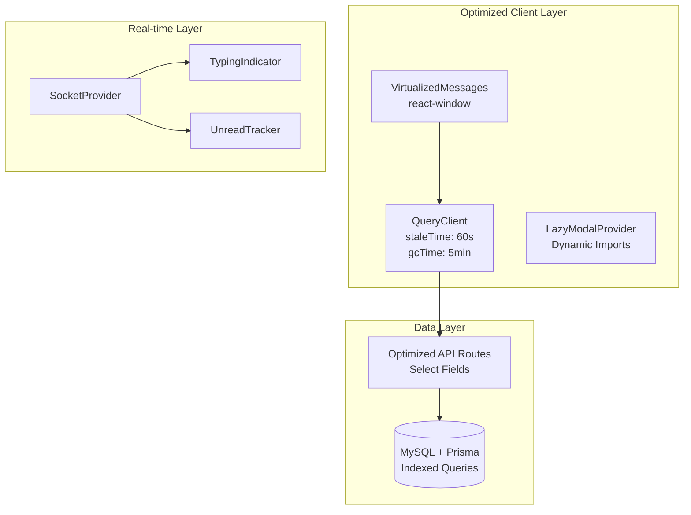

# Design Document: Performance Optimization & Feature Enhancement

## Overview

Tài liệu này mô tả thiết kế chi tiết để tối ưu hóa hiệu năng và bổ sung tính năng mới cho Discord Clone. Các cải tiến được chia thành 2 nhóm chính:

1. **Performance Optimizations**: Cải thiện tốc độ load, giảm memory usage, tối ưu database queries
2. **Feature Enhancements**: Thêm các tính năng mới như search, typing indicators, reactions, unread badges

## Architecture

### Current Architecture Issues

```
┌─────────────────────────────────────────────────────────────┐
│                     Current Problems                         │
├─────────────────────────────────────────────────────────────┤
│ 1. ModalProvider loads ALL 18+ modals on app start          │
│ 2. QueryClient has no staleTime/gcTime configuration        │
│ 3. Database queries fetch full records (no field selection) │
│ 4. Chat messages render ALL messages (no virtualization)    │
│ 5. No typing indicators or message reactions                │
│ 6. No unread message tracking                               │
└─────────────────────────────────────────────────────────────┘
```

### Proposed Architecture



## Components and Interfaces

### 1. Optimized QueryClient Configuration

```typescript
// lib/query-client.ts
interface QueryClientConfig {
  defaultOptions: {
    queries: {
      staleTime: number;      // 60000 (1 minute)
      gcTime: number;         // 300000 (5 minutes)
      retry: number;          // 3
      retryDelay: (attempt: number) => number;
      refetchOnWindowFocus: boolean;
    };
  };
}
```

### 2. Lazy Modal Provider

```typescript
// components/providers/lazy-modal-provider.tsx
interface LazyModalConfig {
  [key: ModalType]: () => Promise<{ default: React.ComponentType }>;
}

interface LazyModalProviderState {
  activeModal: ModalType | null;
  loadedModals: Set<ModalType>;
}
```

### 3. Virtualized Chat Messages

```typescript
// components/chat/virtualized-messages.tsx
interface VirtualizedMessagesProps {
  messages: Message[];
  itemHeight: number;        // Estimated height per message
  overscanCount: number;     // Extra items to render outside viewport
  onLoadMore: () => void;
}
```

### 4. Typing Indicator System

```typescript
// components/chat/typing-indicator.tsx
interface TypingUser {
  id: string;
  name: string;
  timestamp: number;
}

interface TypingIndicatorProps {
  channelId: string;
  currentUserId: string;
}

// Socket events
type TypingEvent = {
  channelId: string;
  userId: string;
  userName: string;
};
```

### 5. Message Reactions

```typescript
// types/reaction.ts
interface Reaction {
  id: string;
  emoji: string;
  messageId: string;
  userId: string;
  createdAt: Date;
}

interface MessageWithReactions extends Message {
  reactions: {
    emoji: string;
    count: number;
    users: { id: string; name: string }[];
    hasReacted: boolean;
  }[];
}
```

### 6. Unread Message Tracker

```typescript
// lib/unread-tracker.ts
interface UnreadState {
  [channelId: string]: {
    count: number;
    lastReadMessageId: string | null;
    lastMessageTimestamp: Date;
  };
}

interface UnreadTrackerAPI {
  markAsRead: (channelId: string) => void;
  getUnreadCount: (channelId: string) => number;
  subscribeToChannel: (channelId: string) => void;
}
```

### 7. Message Search

```typescript
// components/chat/message-search.tsx
interface SearchResult {
  messageId: string;
  content: string;
  highlightedContent: string;
  author: { name: string; imageUrl: string };
  timestamp: Date;
  channelId: string;
}

interface MessageSearchProps {
  serverId: string;
  onResultClick: (messageId: string, channelId: string) => void;
}
```

### 8. Pin Messages

```typescript
// types/pinned-message.ts
interface PinnedMessage {
  id: string;
  messageId: string;
  channelId: string;
  pinnedBy: string;
  pinnedAt: Date;
  message: Message;
}
```

## Data Models

### New Prisma Models

```prisma
// prisma/schema.prisma additions

model Reaction {
  id        String   @id @default(uuid())
  emoji     String
  
  messageId String
  message   Message  @relation(fields: [messageId], references: [id], onDelete: Cascade)
  
  profileId String
  profile   Profile  @relation(fields: [profileId], references: [id], onDelete: Cascade)
  
  createdAt DateTime @default(now())
  
  @@unique([messageId, profileId, emoji])
  @@index([messageId])
  @@index([profileId])
}

model PinnedMessage {
  id        String   @id @default(uuid())
  
  messageId String
  message   Message  @relation(fields: [messageId], references: [id], onDelete: Cascade)
  
  channelId String
  channel   Channel  @relation(fields: [channelId], references: [id], onDelete: Cascade)
  
  pinnedById String
  pinnedBy   Profile  @relation(fields: [pinnedById], references: [id], onDelete: Cascade)
  
  pinnedAt  DateTime @default(now())
  
  @@unique([messageId])
  @@index([channelId])
}

model ChannelReadState {
  id              String   @id @default(uuid())
  
  channelId       String
  channel         Channel  @relation(fields: [channelId], references: [id], onDelete: Cascade)
  
  profileId       String
  profile         Profile  @relation(fields: [profileId], references: [id], onDelete: Cascade)
  
  lastReadMessageId String?
  lastReadAt      DateTime @default(now())
  
  @@unique([channelId, profileId])
  @@index([channelId])
  @@index([profileId])
}
```

### Updated Message Model

```prisma
model Message {
  // ... existing fields
  
  reactions      Reaction[]
  pinnedMessage  PinnedMessage?
}
```

## Correctness Properties

*A property is a characteristic or behavior that should hold true across all valid executions of a system-essentially, a formal statement about what the system should do. Properties serve as the bridge between human-readable specifications and machine-verifiable correctness guarantees.*

Based on the prework analysis, the following correctness properties have been identified:

### Property 1: Cache Stale-While-Revalidate Behavior
*For any* cached data and navigation event, when the user returns to a previously visited channel, the cached data SHALL be displayed immediately while fresh data is fetched in the background.
**Validates: Requirements 1.3**

### Property 2: Network Retry with Exponential Backoff
*For any* failed network request, the system SHALL retry up to 3 times with delays following exponential backoff pattern (e.g., 1s, 2s, 4s).
**Validates: Requirements 1.4**

### Property 3: Single Active Modal Rendering
*For any* application state with multiple modal types defined, only the currently active modal (or none) SHALL be rendered in the DOM at any given time.
**Validates: Requirements 2.3**

### Property 4: Member List Pagination
*For any* server with N members where N > PAGE_SIZE, fetching the member list SHALL return at most PAGE_SIZE members per request.
**Validates: Requirements 3.3**

### Property 5: Virtual Scroll Render Optimization
*For any* message list with N messages, the number of rendered DOM elements SHALL be bounded by viewport capacity plus overscan count, regardless of N.
**Validates: Requirements 4.1**

### Property 6: Scroll Position Preservation on Load More
*For any* scroll position P before loading older messages, after loading completes the visible content SHALL remain at the same logical position.
**Validates: Requirements 4.3**

### Property 7: Incremental Message Append
*For any* new message arrival, only the new message component SHALL be rendered without triggering re-render of existing messages.
**Validates: Requirements 4.4**

### Property 8: Socket Reconnection with Exponential Backoff
*For any* socket disconnection, reconnection attempts SHALL follow exponential backoff pattern with maximum 5 attempts.
**Validates: Requirements 5.1**

### Property 9: Missed Message Sync on Reconnect
*For any* successful socket reconnection, all messages sent during disconnection SHALL be fetched and displayed.
**Validates: Requirements 5.2**

### Property 10: Heartbeat Ping Interval
*For any* idle socket connection, heartbeat pings SHALL be sent at regular intervals (every 25 seconds) to maintain connection.
**Validates: Requirements 5.4**

### Property 11: Search Input Debounce
*For any* sequence of keystrokes within 300ms, only one search API call SHALL be triggered after the debounce period.
**Validates: Requirements 6.1**

### Property 12: Search Result Highlighting
*For any* search term T and result containing T, the rendered result SHALL contain T wrapped in highlight markup.
**Validates: Requirements 6.2**

### Property 13: Typing Event Emission
*For any* user input in the chat field, a typing event SHALL be emitted via socket within 100ms of the first keystroke.
**Validates: Requirements 7.1**

### Property 14: Typing Indicator Display
*For any* received typing event with user info, the typing indicator SHALL display that user's name.
**Validates: Requirements 7.2**

### Property 15: Typing Indicator Timeout
*For any* typing indicator displayed, if no typing event is received for 3 seconds, the indicator SHALL be removed.
**Validates: Requirements 7.3**

### Property 16: Multiple Users Typing Display
*For any* N users typing where N > 2, the indicator SHALL display "N users are typing..." format.
**Validates: Requirements 7.4**

### Property 17: Real-time Reaction Sync
*For any* reaction added to a message, all connected clients viewing that message SHALL receive the update via socket within 500ms.
**Validates: Requirements 8.2**

### Property 18: Reaction Toggle Behavior
*For any* user clicking an existing reaction they've made, their reaction SHALL be removed; clicking a reaction they haven't made SHALL add their reaction.
**Validates: Requirements 8.3**

### Property 19: Reaction Count Accuracy
*For any* message with reactions, the displayed count for each emoji SHALL equal the number of unique users who reacted with that emoji.
**Validates: Requirements 8.4**

### Property 20: Unread Channel Marking
*For any* new message in a channel the user is not currently viewing, that channel SHALL be marked as unread.
**Validates: Requirements 9.1**

### Property 21: Unread Count Badge Accuracy
*For any* channel with N unread messages, the badge SHALL display the value N.
**Validates: Requirements 9.2**

### Property 22: Read State on Channel Open
*For any* channel opened by a user, the unread count for that channel SHALL become 0.
**Validates: Requirements 9.3**

### Property 23: Image Load Failure Fallback
*For any* image that fails to load, a fallback placeholder SHALL be displayed instead of broken image.
**Validates: Requirements 10.3**

### Property 24: Avatar Size Optimization
*For any* avatar displayed at size S pixels, the requested image URL SHALL specify dimensions appropriate for S (e.g., S*2 for retina).
**Validates: Requirements 10.4**

### Property 25: Pin Message Addition
*For any* message pinned by a moderator, that message SHALL appear in the channel's pinned messages list.
**Validates: Requirements 11.1**

### Property 26: Unpin Message Removal
*For any* message unpinned, that message SHALL be immediately removed from the pinned messages list.
**Validates: Requirements 11.4**

## Error Handling

### Network Errors
- All API calls wrapped in try-catch with user-friendly error messages
- Automatic retry with exponential backoff for transient failures
- Offline detection with queue for pending actions

### Socket Errors
- Graceful degradation to polling when WebSocket fails
- Visual indicator for connection status
- Auto-reconnect with missed message sync

### Database Errors
- Transaction rollback on partial failures
- Constraint violation handling with clear error messages
- Connection pool exhaustion prevention

## Testing Strategy

### Property-Based Testing Library
**Library**: fast-check (TypeScript PBT library)

### Unit Tests
- QueryClient configuration validation
- Modal lazy loading behavior
- Debounce function timing
- Typing indicator state management
- Reaction toggle logic
- Unread count calculations

### Property-Based Tests
Each correctness property above will have a corresponding property-based test using fast-check. Tests will:
- Generate random inputs within valid domains
- Run minimum 100 iterations per property
- Include shrinking for minimal failing examples
- Tag tests with property references: `**Feature: performance-optimization, Property N: description**`

### Integration Tests
- Socket event flow for typing indicators
- Real-time reaction synchronization
- Message search with database
- Unread state persistence

### Performance Tests
- Bundle size verification (< 200KB gzipped)
- Virtual scroll performance with 10,000+ messages
- Memory usage monitoring for long sessions
