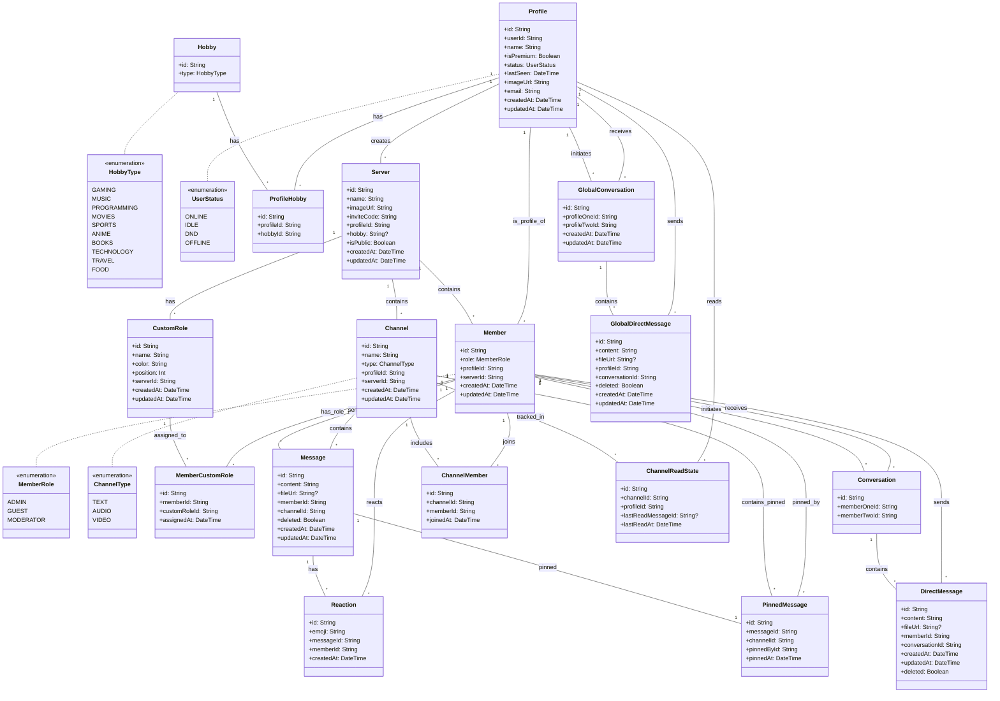

# Class Diagram

This diagram acts as a visual representation of the Prisma schema.

```mermaid
classDiagram
    %% Enums
    class HobbyType {
        <<enumeration>>
        GAMING
        MUSIC
        PROGRAMMING
        MOVIES
        SPORTS
        ANIME
        BOOKS
        TECHNOLOGY
        TRAVEL
        FOOD
    }

    class UserStatus {
        <<enumeration>>
        ONLINE
        IDLE
        DND
        OFFLINE
    }

    class MemberRole {
        <<enumeration>>
        ADMIN
        GUEST
        MODERATOR
    }

    class ChannelType {
        <<enumeration>>
        TEXT
        AUDIO
        VIDEO
    }

    %% Models
    class Hobby {
        +id: String
        +type: HobbyType
    }

    class ProfileHobby {
        +id: String
        +profileId: String
        +hobbyId: String
    }

    class Profile {
        +id: String
        +userId: String
        +name: String
        +isPremium: Boolean
        +status: UserStatus
        +lastSeen: DateTime
        +imageUrl: String
        +email: String
        +createdAt: DateTime
        +updatedAt: DateTime
    }

    class Server {
        +id: String
        +name: String
        +imageUrl: String
        +inviteCode: String
        +profileId: String
        +hobby: String?
        +isPublic: Boolean
        +createdAt: DateTime
        +updatedAt: DateTime
    }

    class CustomRole {
        +id: String
        +name: String
        +color: String
        +position: Int
        +serverId: String
        +createdAt: DateTime
        +updatedAt: DateTime
    }

    class MemberCustomRole {
        +id: String
        +memberId: String
        +customRoleId: String
        +assignedAt: DateTime
    }

    class Member {
        +id: String
        +role: MemberRole
        +profileId: String
        +serverId: String
        +createdAt: DateTime
        +updatedAt: DateTime
    }

    class Channel {
        +id: String
        +name: String
        +type: ChannelType
        +profileId: String
        +serverId: String
        +createdAt: DateTime
        +updatedAt: DateTime
    }

    class Message {
        +id: String
        +content: String
        +fileUrl: String?
        +memberId: String
        +channelId: String
        +deleted: Boolean
        +createdAt: DateTime
        +updatedAt: DateTime
    }

    class Reaction {
        +id: String
        +emoji: String
        +messageId: String
        +memberId: String
        +createdAt: DateTime
    }

    class GlobalConversation {
        +id: String
        +profileOneId: String
        +profileTwoId: String
        +createdAt: DateTime
        +updatedAt: DateTime
    }

    class GlobalDirectMessage {
        +id: String
        +content: String
        +fileUrl: String?
        +profileId: String
        +conversationId: String
        +deleted: Boolean
        +createdAt: DateTime
        +updatedAt: DateTime
    }

    class Conversation {
        +id: String
        +memberOneId: String
        +memberTwoId: String
    }

    class DirectMessage {
        +id: String
        +content: String
        +fileUrl: String?
        +memberId: String
        +conversationId: String
        +createdAt: DateTime
        +updatedAt: DateTime
        +deleted: Boolean
    }

    class ChannelMember {
        +id: String
        +channelId: String
        +memberId: String
        +joinedAt: DateTime
    }

    class ChannelReadState {
        +id: String
        +channelId: String
        +profileId: String
        +lastReadMessageId: String?
        +lastReadAt: DateTime
    }

    class PinnedMessage {
        +id: String
        +messageId: String
        +channelId: String
        +pinnedById: String
        +pinnedAt: DateTime
    }

    %% Relationships
    Hobby "1" -- "*" ProfileHobby : has
    Profile "1" -- "*" ProfileHobby : has

    Profile "1" -- "*" Server : creates
    Server "1" -- "*" Member : contains
    Server "1" -- "*" Channel : contains
    Server "1" -- "*" CustomRole : has

    CustomRole "1" -- "*" MemberCustomRole : assigned_to
    Member "1" -- "*" MemberCustomRole : has_role

    Profile "1" -- "*" Member : is_profile_of
    
    Member "1" -- "*" Message : sends
    Channel "1" -- "*" Message : contains

    Message "1" -- "*" Reaction : has
    Member "1" -- "*" Reaction : reacts

    Channel "1" -- "*" ChannelMember : includes
    Member "1" -- "*" ChannelMember : joins

    Profile "1" -- "*" GlobalConversation : initiates
    Profile "1" -- "*" GlobalConversation : receives
    GlobalConversation "1" -- "*" GlobalDirectMessage : contains
    Profile "1" -- "*" GlobalDirectMessage : sends

    Member "1" -- "*" Conversation : initiates
    Member "1" -- "*" Conversation : receives
    Conversation "1" -- "*" DirectMessage : contains
    Member "1" -- "*" DirectMessage : sends

    Channel "1" -- "*" ChannelReadState : tracked_in
    Profile "1" -- "*" ChannelReadState : reads

    Message "1" -- "1" PinnedMessage : pinned
    Channel "1" -- "*" PinnedMessage : contains_pinned
    Member "1" -- "*" PinnedMessage : pinned_by
    
    %% Enum usage
    Hobby .. HobbyType
    Profile .. UserStatus
    Member .. MemberRole
    Channel .. ChannelType
```
