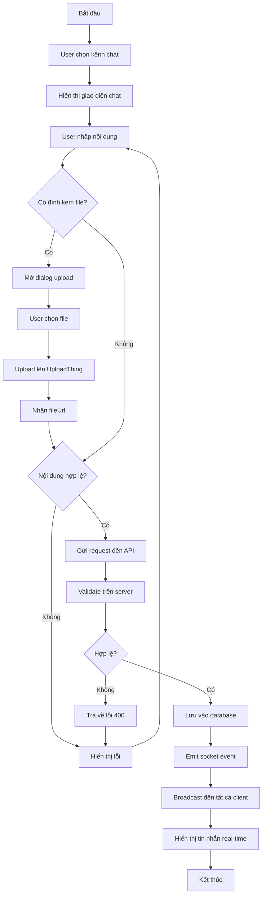

# BIỂU ĐỒ HOẠT ĐỘNG: GỬI TIN NHẮN

## Mermaid Diagram

## Mô tả các hoạt động

| STT | Hoạt động | Mô tả |
|-----|-----------|-------|
| 1 | Chọn kênh chat | User click vào kênh trong sidebar |
| 2 | Nhập nội dung | User gõ tin nhắn vào input |
| 3 | Upload file | Optional - đính kèm hình ảnh/file |
| 4 | Validate | Kiểm tra nội dung không rỗng |
| 5 | Lưu database | INSERT vào bảng Message |
| 6 | Socket emit | Gửi event qua Socket.IO |
| 7 | Broadcast | Gửi đến tất cả client trong channel |
