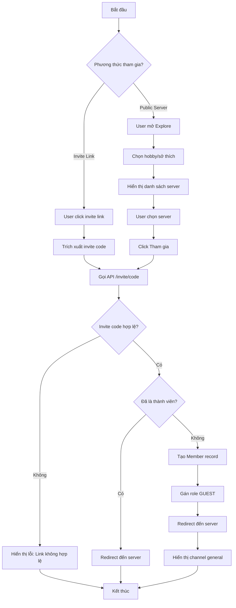

# BIỂU ĐỒ HOẠT ĐỘNG: THAM GIA SERVER

## Mermaid Diagram

## Mô tả các hoạt động

| STT | Hoạt động | Mô tả |
|-----|-----------|-------|
| 1 | Click invite link | User truy cập URL /invite/{code} |
| 2 | Explore public | User duyệt server công khai theo hobby |
| 3 | Validate code | Kiểm tra invite code trong database |
| 4 | Check membership | Kiểm tra user đã join chưa |
| 5 | Create Member | INSERT vào bảng Member |
| 6 | Redirect | Chuyển hướng đến /servers/{id} |
