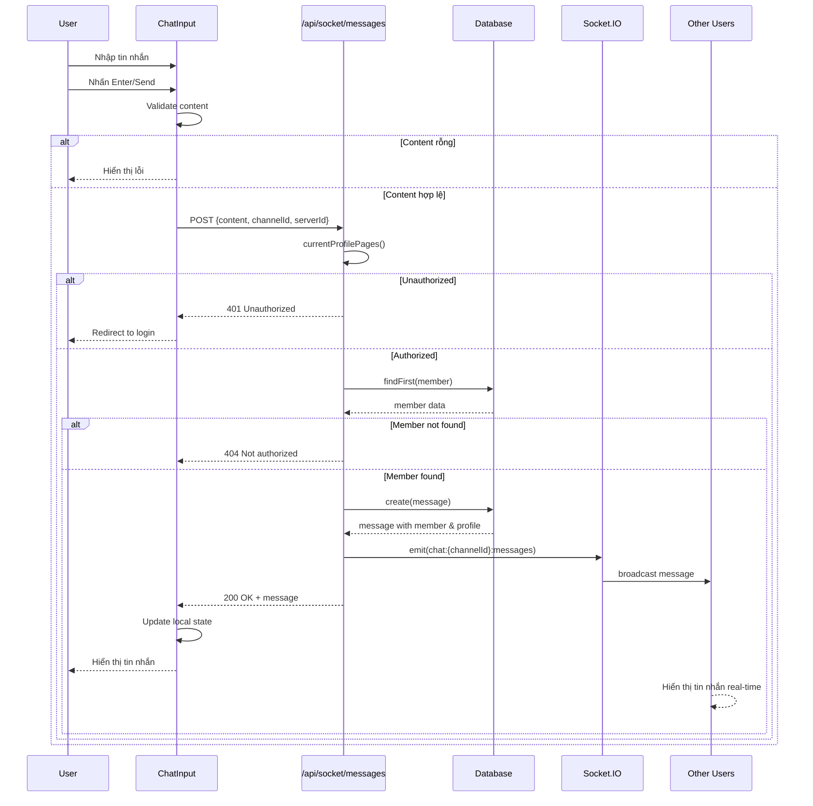

# BIỂU ĐỒ TRÌNH TỰ: GỬI TIN NHẮN

## Mermaid Sequence Diagram

## Mô tả các đối tượng

| Đối tượng | Mô tả |
|-----------|-------|
| User | Người dùng tương tác |
| ChatInput | Component nhập tin nhắn |
| API | Socket API endpoint |
| Database | MySQL via Prisma |
| Socket.IO | Real-time server |
| Other Users | Các thành viên khác trong channel |

## Các message chính

| STT | Message | Mô tả |
|-----|---------|-------|
| 1 | POST /api/socket/messages | Gửi tin nhắn mới |
| 2 | emit(chat:{channelId}:messages) | Broadcast qua socket |
| 3 | 200 OK | Phản hồi thành công |
