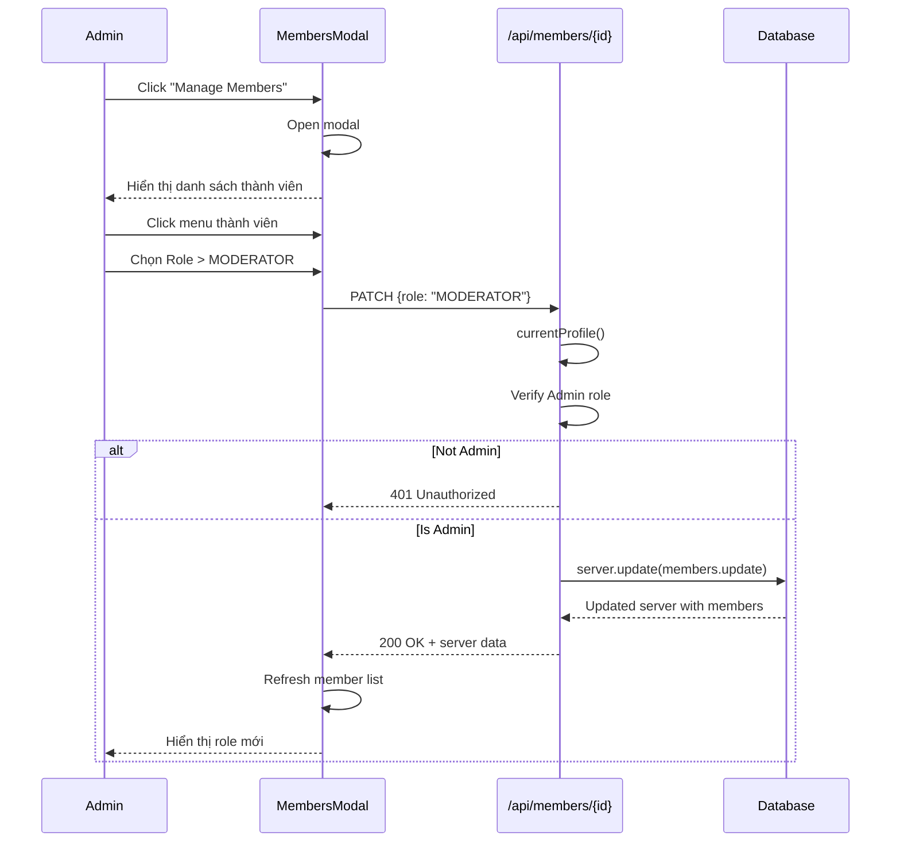
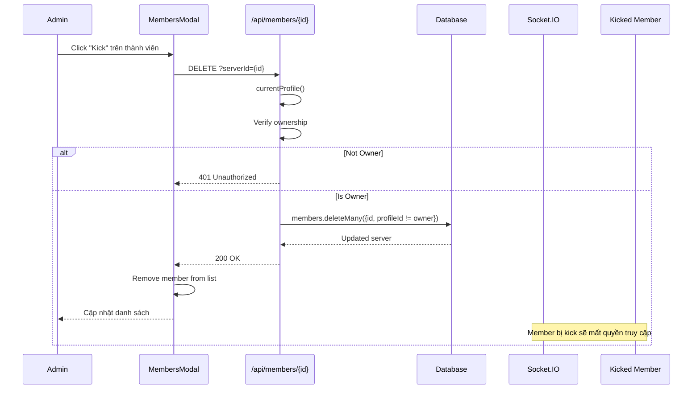

# BIỂU ĐỒ TRÌNH TỰ: QUẢN LÝ THÀNH VIÊN

## Mermaid Sequence Diagram - Thay đổi Role

## Mermaid Sequence Diagram - Kick Member

## Mô tả các đối tượng

| Đối tượng | Mô tả |
|-----------|-------|
| Admin | Người có quyền ADMIN |
| MembersModal | Component quản lý thành viên |
| API | REST API endpoint |
| Database | MySQL via Prisma |
