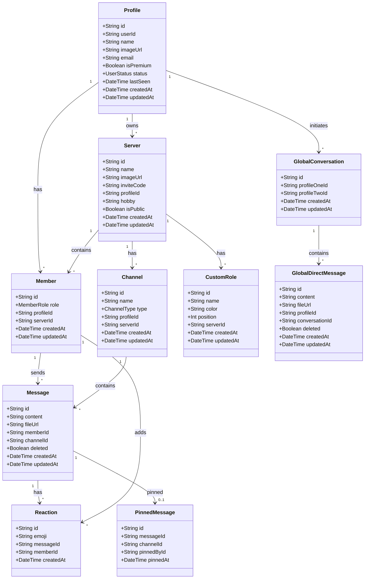

# BIỂU ĐỒ LỚP (CLASS DIAGRAM)

## Mermaid Class Diagram



## Mô tả các lớp chính

| Lớp | Mô tả |
|-----|-------|
| Profile | Thông tin người dùng (từ Clerk) |
| Server | Máy chủ/nhóm chat |
| Member | Thành viên trong server |
| Channel | Kênh chat (TEXT/AUDIO/VIDEO) |
| Message | Tin nhắn trong channel |
| CustomRole | Role tùy chỉnh trong server |
| Reaction | Emoji reaction trên tin nhắn |
| GlobalConversation | Cuộc hội thoại DM |
| GlobalDirectMessage | Tin nhắn trực tiếp |
| PinnedMessage | Tin nhắn được ghim |

## Enum Types

```
MemberRole: ADMIN | MODERATOR | GUEST
ChannelType: TEXT | AUDIO | VIDEO
UserStatus: ONLINE | IDLE | DND | OFFLINE
HobbyType: GAMING | MUSIC | PROGRAMMING | MOVIES | SPORTS | ANIME | BOOKS | TECHNOLOGY | TRAVEL | FOOD
```
